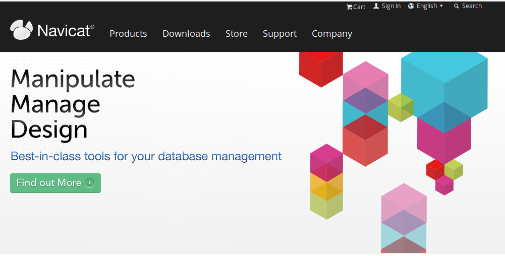

# Database Migration with sql2o

Setelah development, biasanya kita akan melakukan tahap yang namanya migration data dari program lama ke aplikasi yang kita sedang develop.
biasanya kita melakukan mapping ulang dari aplikasi yang lama ke yang baru melalui database. Tidak jarang juga melakukan proses ini dilakukan dengan 
database management sistem yang berbeda contohnya yang sedang saya alami adalah dari Microsoft Visual Fox PRO ke PostgreSQL.

Dari sistem databasenya ini kita harus pindahkan datanya ke sistem database management system yang baru, 
dengan menggunakan plugin sql2o ini kita dapat dengan mudah melakukan migrasinya. Pertama kita perlu mendownload aplikasi 
[Navicat Premium](https://www.navicat.com/)



Kemudian kita convert dari file `.DBF` ke PostgreSQL untuk memudahkan proses query cukup dengan 1 bahasa saja yaitu postgresql, 
setelah proses convert berhasil jadi misalnya saya punya database dengan nama `sql2o_source`

Setelah itu kita buat project dengan maven dan tambahkan dependency seperti berikut:

```xml
<?xml version="1.0" encoding="UTF-8"?>
<project xmlns="http://maven.apache.org/POM/4.0.0"
         xmlns:xsi="http://www.w3.org/2001/XMLSchema-instance"
         xsi:schemaLocation="http://maven.apache.org/POM/4.0.0 http://maven.apache.org/xsd/maven-4.0.0.xsd">
    <modelVersion>4.0.0</modelVersion>

    <groupId>com.outlook.dimmaryanto93.engineer</groupId>
    <artifactId>belajar.sql2o</artifactId>
    <version>1.0-SNAPSHOT</version>
    <dependencies>
        <!--unit testing-->
        <dependency>
            <groupId>junit</groupId>
            <artifactId>junit</artifactId>
            <version>4.12</version>
        </dependency>

        <!--database libraries-->
        <dependency>
            <groupId>org.sql2o</groupId>
            <artifactId>sql2o</artifactId>
            <version>1.5.4</version>
        </dependency>
        <dependency>
            <groupId>org.postgresql</groupId>
            <artifactId>postgresql</artifactId>
            <version>9.4.1212.jre7</version>
        </dependency>

        <!--project lombok-->
        <dependency>
            <groupId>org.projectlombok</groupId>
            <artifactId>lombok</artifactId>
            <version>1.16.16</version>
        </dependency>
    </dependencies>
</project>
```

Setelah membuat project maven. kita setup connectionnya dengan membuat file `jdbc.source.properties` untuk tempat menyimpan data dari aplikasi yang lama
dan satu lagi `jdbc.target.properties` untuk menyimpan data hasil perpindahan data. Simpan file tersebut dalam folder `src/main/resources/`

```properties
# jdbc.source.properties
jdbc.url=jdbc:postgresql://localhost:5432/sql2o_source
jdbc.username=postgres
jdbc.password=admin
```

```properties
# jdbc.target.properties
jdbc.url=jdbc:postgresql://localhost:5432/sql2o_target
jdbc.username=postgres
jdbc.password=admin
```

